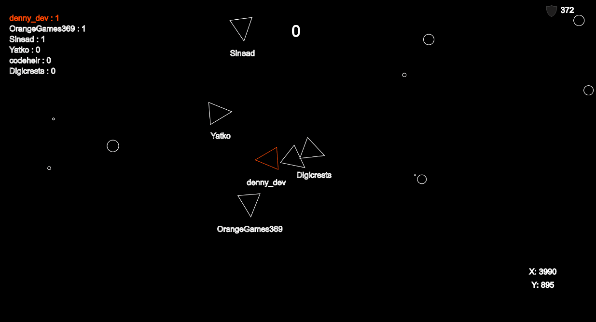

<h1 align="center">
   
  🚀
   
  Spaceheir
   
</h1>

<h4 align="center">A pretty bloody brilliant multiplayer space shooting game</h4>

  
   
   
  
  
 
  

A multiplayer game that I've been creating on stream at [twitch.tv/codeheir](https://www.twitch.tv/codeheir) as a fun little project, it started off as an asteroids replica, but idea after idea has led me to this space game! 

Go play the game in its current state at [spaceheir.com!](http://spaceheir.com/)
## Some of the stuff to do!
Feel free to branch and play around, go to https://trello.com/b/HBwddn26/stream-royale-game to see what needs doing!

## Recent (I promise it's not *that* laggy)

## A while ago

